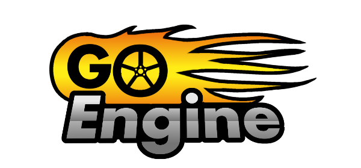

# GO Engine

## 1. Resumen: ##
*Go Engine* es un motor gráfico multiplataforma para poder utilizar como base a la hora de realizar videojuegos. El nombre proviene de la orientación del proyecto (*GameObject Engine*), basado en entidades y componentes.

## 2. Descripción detallada: ##
En este proyecto, trataremos de implementar un motor de videojuegos multiplataforma (*Windows, Linux y Mac*) que será utilizado como API por los usuarios para realizar sus propios videojuegos.
El sistema dispondrá de una simple interfaz gráfica que permitirá a los usuarios trabajar de una forma más cómoda e intuitiva.
Dentro de las especificaciones del motor, podemos mencionar las siguientes:

- Gráficos 3D con *OpenGL*
- Sonido 3D con *OpenAL* (u otras)
- Capacidad de red (networking)
- Motor físico con *Bullet Engine*
- Interfaz gráfica de usuario sencilla (o GUI)

Para ello, se usará un paradigma del tipo orientado a objetos, en este caso, orientado a objetos y componentes (véase [éste](http://www.genbetadev.com/programacion-de-videojuegos/diseno-de-videojuegos-orientado-a-entidades-y-componentes "éste") enlace ).

Además, se desarrollarán una serie de sistemas que trabajarán con dichos objetos (como mostrarlos por pantalla, actualizar su posición, etc).

Se definirán 3 partes en el proyecto bien claras y definidas:

- **Engine**: Parte principal del motor (llámese kernel, núcleo, etc), conteniendo las definiciones de los objetos de juego, componentes y sistemas.
- **Usuario**: Apartado en el que irá el código del usuario.
- **Editor**: Interfaz gráfica para que el usuario pueda trabajar cómodamente.

## 3. Implementación: ##
***C++*** implementado en [**Mingw**](http://www.mingw.org/) (principalmente), *GCC* o cualquier compilador libre de C++

## 4. Librerías y dependencias: ##
- [OpenGL32](http://www.opengl.org/ "OpenGL32") (Gráficos) 
- [OpenAL](http://kcat.strangesoft.net/openal.html "OpenAL") (Sonido)
- [Qt](http://qt-project.org/ "Qt") (Interfaz gráfica del editor)
- [SDL2](http://www.libsdl.org/ "SDL2")
	- [SDL_image 2.0](http://www.libsdl.org/projects/SDL_image/ "SDL_image 2.0")
	- [SDL_ttf 2.0](http://www.libsdl.org/projects/SDL_ttf/ "SDL_ttf 2.0")
	- [SDL_mixer 2.0	](http://www.libsdl.org/projects/SDL_mixer/ "SDL_mixer 2.0")
	- [SDL_net 2.0](	http://www.libsdl.org/projects/SDL_net/ "SDL_net 2.0")
- [SOIL](http://www.opengl.org/wiki/Image_Libraries "SOIL") (Imágenes)
- [Bullet Engine](http://bulletphysics.org/wordpress/ "Bullet Engine") (Física)
- [ASSIMP](http://assimp.sourceforge.net/ "ASSIMP") (Modelos 3D, etc)
- [GLM](http://glm.g-truc.net/ "GL Maths") (Matemática de gráficos 3D)
- [Boost](http://www.boost.org/ "Boost") (Serialization) (Planteado eliminar su uso)
- Otras menores (ya se mencionarán cuando se decidan)

## 5. Autores ##

Este proyecto ha sido desarrollado, en conjunto, por:

- Daniel Herzog Cruz, ***Wikiti***: [wikiti.doghound@gmail.com](mailto:wikiti.doghound@gmail.com)
- Laura Fariña Rodríguez, ***Kiarapoke***: [kiarapoke@gmail.com](mailto:kiarapoke@gmail.com)
- Eliasib Jesús García Martín, ***Eliasib13***: [eliasib.lv.12@gmail.com](mailto:eliasib.lv13@gmail.com)

## 6. Enlaces de interés ##

- Página VIII CUSL: [http://www.concursosoftwarelibre.org/1314/proyectos/20](http://www.concursosoftwarelibre.org/1314/proyectos/20)
- Blog Wordpress: [http://goengine.wordpress.com/](http://goengine.wordpress.com/)